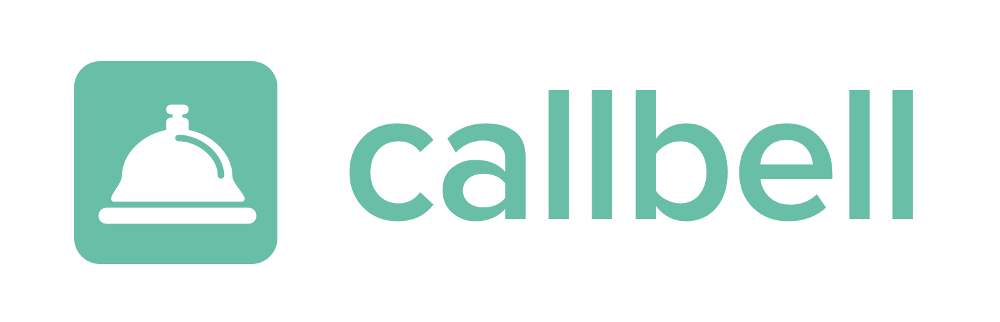

<p align="center"></p>

# Callbell Full Stack Test

Hi there 👋 Thanks for taking the time to do this test! We hope that you're going to have fun!

This test was built to be performed under 2-3 hours at best: The goal here is to allow you to build an MVP of a Trello Clone Board.

We'll discuss your work (choices, code syntax, mistakes if there are some, etc.) during a review call after you have completed the assignment.

**Carefully read all the instructions, then give yourself a limited time.**
If you struggle to finish it, value your time and don't spend days on it. Just submit your best effort.

⚠️ If you think something is wrong with the test (doesn't run as expected, missing instructions, ...), please email me at [gianluca@callbell.eu](mailto:gianluca@callbell.eu).

## 🚀 Objectives

The goal of this full stack test is to assess your skills on:

- Installing and running a Rails development environment;
- Making API calls to third-party services;
- Manipulating webhooks;
- Writing some unit tests with Rspec;
- Understanding basics of performance and security;
- Adapting to an existing architecture;
- Create basic react components to display a series of results;
- Following instructions and looking for answers in documentations.

The server should be able to:

- Create Trello cards through a secured route;
- Listen to Trello webhooks to save created and updated cards into a local database;

The React frontend app should be able to:

- Show the list of the cards saved in the database
- Allow to create a new card

The exercise is to write some code **only** where the `TODO: ` instructions are:

- [./app/controllers/api/v1/cards_controller.rb](./app/controllers/api/v1/cards_controller.rb): write the endpoint to create cards (see [API reference](#api-reference) below);
- [./app/controllers/api/v1/webhooks_controller.rb](./app/controllers/api/v1/webhooks_controller.rb): write the Trello webhook that saves cards to the database;
- [./spec/requests/api/v1/cards_spec.rb](./spec/requests/cards_spec.rb): write the the tests for the controller;
- [./spec/requests/api/v1/webhooks_controller_spec.rb](./spec/requests/api/v1/webhooks_controller_spec.rb): write the the tests for the trello webhook;
- [./app/models/card.rb](./app/models/card.rb): write the methods needed in the model;
- [./app/javascript/packs/components/App.jsx](./app/javascript/packs/components/App.jsx): write the React components (you can also use the `components` if you want to split into multiple components)

## 📦 Installing the project

```
git clone git@github.com:callbellchat/callbell-fullstack-test.git
cd callbell-fullstack-test
yarn install
cp .env.sample .env
bundle install
```

Alternatively, you can [download the source code](https://github.com/callbellchat/callbell-fullstack-test/archive/master.zip) and unzip it.

### Create a Trello account

1. Create a free [Trello](https://trello.com) account if you don't have one already, then visit https://trello.com/app-key to generate credentials.
2. Create a new board `Callbell full stack test`.
3. Open the board, and append `.json` into the URL bar to get the board ID (example: `https://trello.com/b/W6RusfMK/epycure-back-end-test.json`).
4. Copy the credentials and the board ID into your `.env` file.

### Running the project

You first need to expose your local API so that Trello can send events to your webhooks. For this, run `npx ngrok http 3000` to listen to `localhost:3000`. **Keep that terminal open for the whole test**.

On another terminal, run your server:

```
bundle exec rails s
```

Register your webhook using the following cURL command on a new terminal:

```
curl -X POST -H "Content-Type: application/json" \
https://api.trello.com/1/tokens/{YOUR_TRELLO_API_TOKEN}/webhooks/ \
-d '{
  "key": "{YOUR_TRELLO_API_KEY}",
  "callbackURL": "https://<YOUR_NGROK_ID>.ngrok.io/api/v1/webhooks",
  "idModel":<YOUR_TRELLO_BOARD_ID>,
  "description": "My first webhook"
}'
```

Your server will be available at [localhost:3000](http://localhost:3000). Changes made to the code should reload automatically.

**Important note:** if for any reason you have to restart ngrok, the webhooks URL will therefore change, so you'll need to register the webhooks again.

- To run tests: `bundle exec rspec`.

## 🧰 API reference

<table>
  <thead>
    <tr>
      <th>Endpoint</th>
      <th>Action</th>
      <th>Payload</th>
      <th>Response</th>
    </tr>
  </thead>
  <tbody>
    <tr>
      <td><code>POST /cards</code></td>
      <td>Create a new card in Trello</td>
      <td><div class="highlight highlight-source-json"><pre>{
  "name": "My new Trello Card !",
  "idList": "5fa106c99173787897d5ff3e",
  "description": "This is a nice description :).",
  "due": "2020-12-24",
}</pre></div></td>
      <td>
        <details>
          <summary>See response body</summary>
          <div class="highlight highlight-source-json"><pre>{
    "ok": true,
    "data": {
        "id": "5fa264697c310c4623b40eda",
        // ...
    }
}</pre></div>
        </details>
      </td>
    </tr>
  </tbody>
</table>

In case of parameters error, the server returns a `422` error code.
In case of a dependency error, the server returns a `424` error code.

## 🗒 Additional notes

- You'll find specific information and help where the `TODO: ` instructions are.
- You should not need to add any package to the project, but feel free to use additional deps if needed (both backend and frontend)
- For interacting with Trello API you can either use your own REST service or use a [gem](https://github.com/jeremytregunna/ruby-trello). The choice is up to you!

---

## 📪 Once you're done

Send me an email at [gianluca@callbell.eu](mailto:gianluca@callbell.eu) with subject `[Full Stack Test]`, and containing:

- either a link to the GitHub repository of your project (if you want to keep it private, add [@proudlygeek](http://github.com/proudlygeek) as collaborator),
- **OR** a ZIP **WITHOUT the `node_modules` folder**;
- **your next availabilities** so I can schedule a review call with you.

**Thanks for participating, have fun!**  
_Gianluca, CTO at Callbell_
